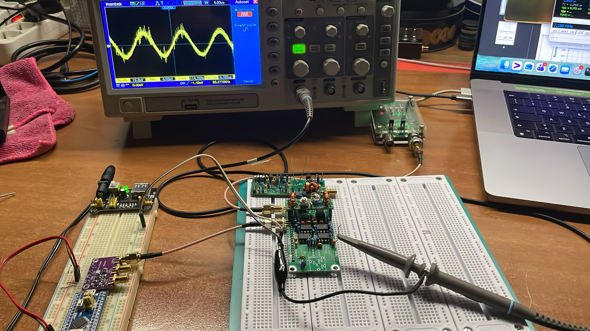
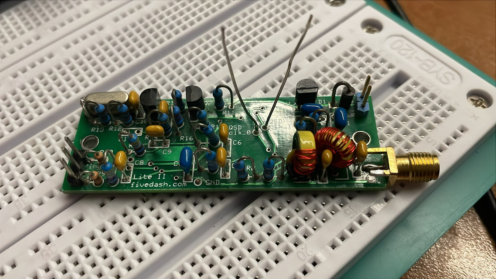
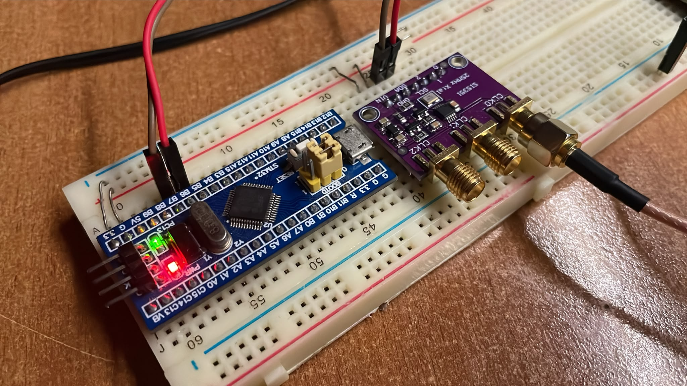
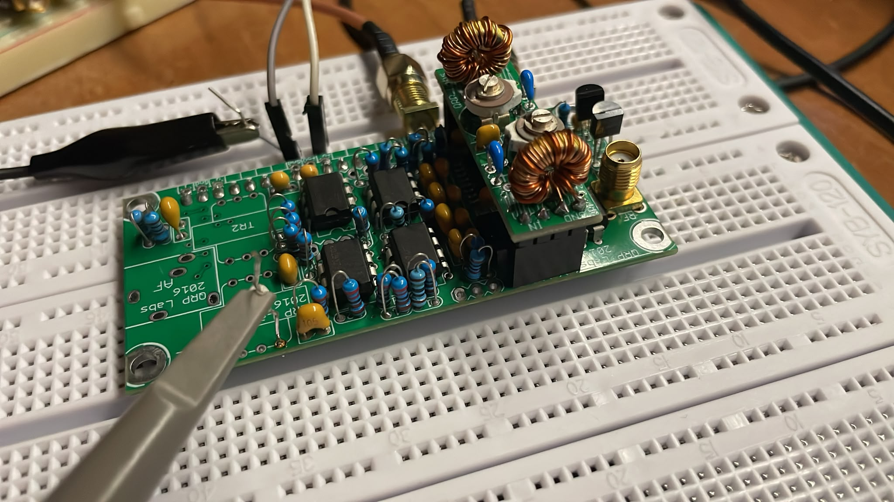
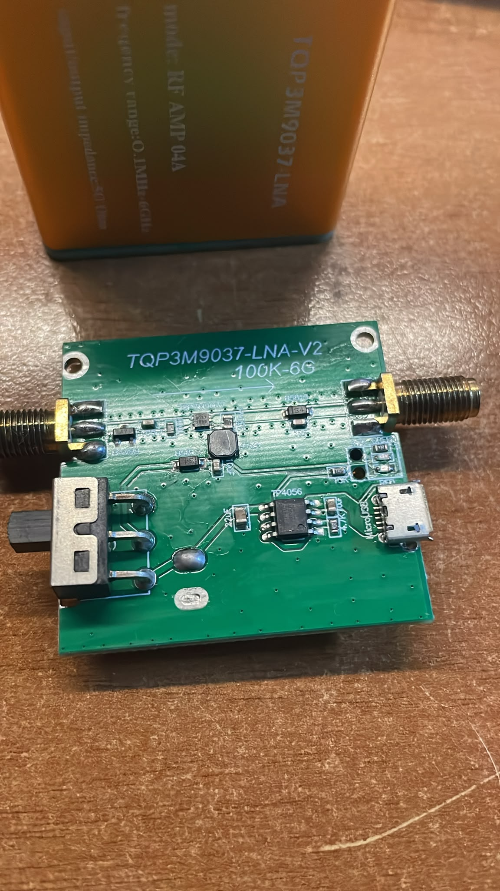
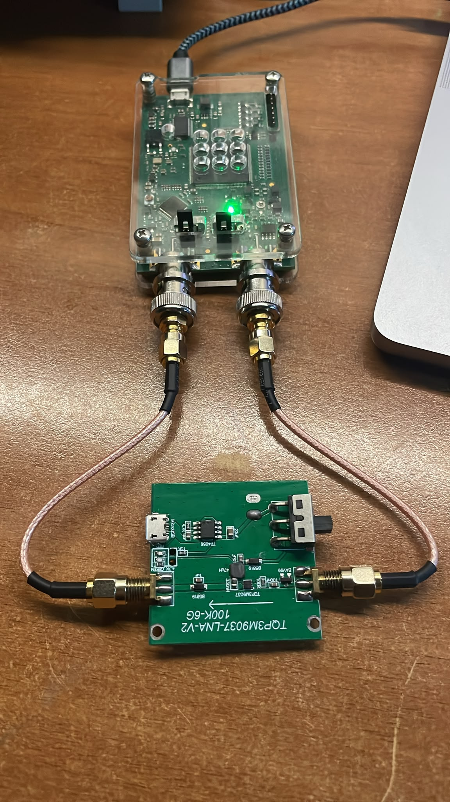

# RF Front-End Selection for STM32H7 SDR Project

## Goal

Design a multiband HF SDR receiver based on STM32H7B3.

Target bands:

- 80m
- 40m
- 30m
- 20m
- 17m
- 15m
- 10m

The original idea was to use a relay-switched BPF bank and keep the rest of the hardware broadband.

```text
Antenna
   |
Relay-selected BPF
   |
RF Front-End
   |
ADC
   |
Undersampling
   |
DSP / DDC
```

This allows changing only:

- selected BPF
- ADC sampling frequency
- DSP parameters

while leaving the RF front-end unchanged.

---

# Two possible SDR architectures

## Architecture 1: Tayloe Detector

```text
Antenna
   |
BPF
   |
Tayloe Detector
   |
Audio / Baseband I/Q
   |
ADC
   |
DSP
```

Advantages:

- excellent dynamic range
- proven architecture
- simple DSP
- low ADC speed required

Disadvantages:

- local oscillator required
- frequency-specific architecture
- less flexible than direct RF sampling

---

## Architecture 2: Direct RF Undersampling

```text
Antenna
   |
BPF
   |
Broadband LNA
   |
ADC
   |
Undersampling
   |
DSP
```

Advantages:

- simpler signal chain
- no Tayloe detector
- no quadrature switching
- same hardware for all bands

Disadvantages:

- ADC performance becomes critical
- RF front-end must be carefully designed
- dynamic range depends heavily on ADC

---

# Why compare Tayloe receivers?

Before selecting the RF front-end for direct sampling, two existing Tayloe-based receivers were characterised:

1. SoftRock Lite II
2. QRP Labs Receiver

The idea was to establish a baseline.

If a future:

```text
BPF
+
LNA
+
STM32H7 ADC
```

cannot outperform the existing receivers, then there is little reason to replace them.

---

# Test Setup

## Instruments

- **Signal source:** OSA103Mini VNA / signal generator
  - Internal step attenuator: 0 to −62 dB (minimum output ≈ 1 mVpp into 50 Ω)
  - For −70 dBm: OSA set to −50 dBm + external 20 dB SMA attenuator in series
- **Receiver output:** measured with a Hantek digital oscilloscope (Vpp)

## MDS Criterion

Minimum Detectable Signal (MDS) is defined here as the lowest input level at which a signal is **visually distinguishable** from the noise floor on the oscilloscope. This is a comparative criterion, not a formal noise-figure measurement.

## Setup Photo



The QRP Labs receiver was configured with LO around 7.1 MHz.

When RF was offset from LO, the output frequency moved accordingly and appeared as an audio-frequency beat note. This confirmed correct Tayloe operation.

Example:

```text
7.100 MHz RF -> ~150 Hz output

7.120 MHz RF -> ~20 kHz output

7.150 MHz RF -> ~50.6 kHz output
```

---

# Comparison Results

## SoftRock Lite II

The SoftRock Lite II has an onboard crystal oscillator at **28.224 MHz**. The Tayloe detector divides this by 4, giving a center frequency of **7.056 MHz**.



Estimated voltage gain (V_out / V_in, 50 Ω source, unloaded output):

| RF Input | Output | Est. Gain |
|-----------|----------|-----------|
| -70 dBm | 5 mVpp | ~28 dB |
| -62 dBm | 15 mVpp | ~30 dB |
| -48 dBm | 42 mVpp | ~24 dB |
| -42 dBm | 82 mVpp | ~24 dB |
| -30 dBm | 320 mVpp | ~24 dB |
| -20 dBm | 1.01 Vpp | ~24 dB |
| -13 dBm | 2.14 Vpp | ~24 dB |

> Note: higher apparent gain at −70/−62 dBm is likely due to oscilloscope measurement uncertainty at sub-mV input levels.

---

## QRP Labs Tayloe

The QRP Labs receiver was driven by an external **SI5351A** module used as LO at **7.1 MHz**, controlled via I2C from an STM32.



The output transformers were **not fitted**: they are only needed when connecting to a soundcard. For this SDR project the I/Q baseband is fed directly into the STM32H7 ADC, so the transformers are unnecessary.



Estimated voltage gain (V_out / V_in, 50 Ω source, unloaded output):

| RF Input | Output | Est. Gain |
|-----------|----------|-----------|
| -70 dBm | not detectable | — |
| -62 dBm | not detectable | — |
| -48 dBm | 50 mVpp | ~26 dB |
| -42 dBm | 90 mVpp | ~25 dB |
| -30 dBm | 1.32 Vpp | ~36 dB |
| -20 dBm | 2.91 Vpp | ~33 dB ⚠ compressing |
| -13 dBm | 2.98 Vpp | ~27 dB ⚠ saturated |

> Note: the gain jump between −42 and −30 dBm suggests the on-board AF amplifier stage coming into its full operating region.

---

# Analysis

## Weak Signals (below −62 dBm)

Reference: S9 = −73 dBm.

At −70 dBm, SoftRock produces **5 mVpp** while QRP Labs detects nothing.  
At −62 dBm, SoftRock still produces **15 mVpp** while QRP Labs remains below the noise floor.

**Conclusion:** SoftRock Lite II is clearly superior for near-S9 and weak signals.

---

## Medium Signals (−48 to −30 dBm)

QRP Labs produces significantly more output voltage in this range:

| Level | SoftRock | QRP Labs |
|---|---|---|
| −48 dBm | 42 mVpp | 50 mVpp |
| −42 dBm | 82 mVpp | 90 mVpp |
| −30 dBm | 320 mVpp | **1.32 Vpp** |

**Conclusion:** QRP Labs provides considerably more conversion gain at medium signal levels, likely due to its on-board AF amplifier stage.

---

## Strong Signals (above −20 dBm)

QRP Labs output increases from 2.91 Vpp to only 2.98 Vpp between −20 and −13 dBm. A 7 dB input increase yields only +0.07 Vpp output — clear compression saturating at ≈ 3 Vpp.

SoftRock output continues to increase linearly: 1.01 Vpp → 2.14 Vpp (+6.5 dB output for +7 dB input).

**Conclusion:** QRP Labs compresses around −20 dBm. SoftRock remains linear past −13 dBm.

---

# Dynamic Range Analysis

## Minimum Detectable Signal (MDS)

| Receiver | MDS |
|---|---|
| SoftRock Lite II | **−70 dBm** |
| QRP Labs Tayloe | **−48 dBm** |

SoftRock detects signals 22 dB weaker than QRP Labs.

## 1 dB Compression Point

| Receiver | Compression |
|---|---|
| SoftRock Lite II | not observed up to −13 dBm |
| QRP Labs Tayloe | ≈ −20 dBm (output saturates at ≈ 3 Vpp) |

QRP Labs shows obvious compression: only +0.07 Vpp output gain for 7 dB more input between −20 and −13 dBm.

## Linear Dynamic Range

| Receiver | MDS | Compression | Dynamic Range |
|---|---|---|---|
| SoftRock Lite II | −70 dBm | > −13 dBm | **≥ 57 dB** |
| QRP Labs Tayloe | −48 dBm | ≈ −20 dBm | **≈ 28 dB** |

## Verdict

**SoftRock Lite II has clearly superior dynamic range.**

QRP Labs has higher conversion gain (~36 dB vs ~24 dB estimated), but this causes it to saturate much earlier.
SoftRock is more linear across the full range and detects signals 22 dB weaker.

For an SDR where the ADC must handle strong and weak signals simultaneously, **SoftRock is the better reference design**.

---

# Current Ranking

| Category | Winner | Reason |
|---|---|---|
| Weak signals (< −48 dBm) | **SoftRock Lite II** | MDS −70 dBm vs −48 dBm; dynamic range ≥ 57 dB vs 28 dB |
| Medium signals (−48 to −30 dBm) | **QRP Labs Tayloe** | ~36 dB conversion gain vs ~24 dB; 4× more output voltage |
| Strong signals (> −20 dBm) | **SoftRock Lite II** | Remains linear; QRP Labs saturates at ≈ 3 Vpp |
| Overall for SDR baseline | **SoftRock Lite II** | Superior linearity and dynamic range across all levels |

---

# TQP3M9037-LNA-V2 — Measurement Results

Cost: **13 EUR**. Module: **TQP3M9037-LNA-V2 100K–6G** (Chinese broadband LNA board).

## Physical Condition on Arrival

The module arrived in poor physical condition:

- SMA nuts were loose inside the bag — not fitted on the connectors
- SMA connectors were heavily oxidised
- PCB covered in flux residue and unmelted solder paste balls



After disassembly, cleaning the PCB, and polishing the SMA connectors with a cotton swab, the module was reconnected and tested. Despite low expectations, performance was surprisingly good.

> **Note:** The board silkscreen reads **100K–6G**, meaning the PCB design claims operation down to 100 kHz — well below the TQP3M9037 chip's datasheet start frequency of 400 MHz. Bias network and matching components on the V2 board extend HF coverage significantly.

## Measurement Setup



- **Signal source / output power meter:** OSA103Mini (used as two-port: TX → LNA input, LNA output → RX port)
- **Frequency range tested:** 1 MHz – 10 MHz (HF, outside datasheet spec of the MMIC itself)
- **Output measured in dBm** (power referenced to 50 Ω), unlike the oscilloscope Vpp method used for the Tayloe receivers

## Raw Measurement Data

| RF Input (dBm) | Output (dBm) | Gain (dB) | Notes |
|----------------|--------------|-----------|-------|
| −70 | −41.75 | **+28.25** | |
| −62 | −34.04 | **+27.96** | |
| −48 | −20.04 | **+27.96** | |
| −42 | −13.97 | **+28.03** | |
| −30 | −1.94 | **+28.06** | last reliably measured point |
| −20 | +3.79 | +23.79 | ⚠ OSA103Mini RX port overdriven |
| −13 | +4.04 | +17.04 | ⚠ OSA103Mini RX port overdriven |

## Gain Linearity

In the input range −70 to −30 dBm the gain is **28.0 ± 0.1 dB** — essentially flat across a 40 dB window. This is exceptional linearity for a €13 module operating well outside its rated frequency band.

The apparent gain drop at −20 and −13 dBm was caused by the **OSA103Mini RX port being overdriven**, not by LNA compression. The LNA itself remained linear; the measurement instrument was the bottleneck. True P1dB of the LNA could not be determined with this setup.

## Three-Way Comparison

For comparison, TQP3M9037 output is converted from dBm to Vpp (50 Ω):

| RF Input | SoftRock Lite II | QRP Labs Tayloe | TQP3M9037 LNA |
|----------|-----------------|-----------------|----------------|
| −70 dBm | 5 mVpp | n.d. | **5.2 mVpp** |
| −62 dBm | 15 mVpp | n.d. | **12.6 mVpp** |
| −48 dBm | 42 mVpp | 50 mVpp | **63 mVpp** |
| −42 dBm | 82 mVpp | 90 mVpp | **127 mVpp** |
| −30 dBm | 320 mVpp | 1.32 Vpp | **506 mVpp** |
| −20 dBm | 1.01 Vpp | 2.91 Vpp ⚠ | **0.98 Vpp** ⚠ |
| −13 dBm | 2.14 Vpp | 2.98 Vpp ⚠ | **1.01 Vpp** ⚠ |

> ⚠ = for TQP3M9037 rows: OSA103Mini RX port overdriven — LNA was not the limiting element

> **Important architectural note:** SoftRock and QRP Labs are complete receivers — they output demodulated baseband I/Q. The TQP3M9037 is a pure broadband gain block: it outputs amplified RF, which must still be fed into an ADC for direct undersampling. The table above compares amplitudes, not architectures.

## Analysis

### MDS

The LNA achieves MDS ≤ −70 dBm — the same as SoftRock Lite II, and 22 dB better than QRP Labs. Even though the LNA is not a receiver by itself, it does not introduce a sensitivity penalty relative to the best Tayloe front-end tested.

### Gain

~28 dB across the entire linear range, comparable to SoftRock. The gain is extremely flat — less than 0.1 dB variation across a 40 dB input window.

### Compression

The gain drop observed at −20 and −13 dBm was **not LNA compression** — it was the OSA103Mini RX port reaching its own input limit. The LNA output at those levels (+3.79 / +4.04 dBm) exceeded what the VNA's receiver could handle. The LNA itself remained linear throughout the test. True P1dB of the TQP3M9037 is not determined from this dataset; a higher-range power meter or spectrum analyser would be needed.

### Linear Dynamic Range

| Device | MDS | Compression | Linear Range |
|--------|-----|-------------|--------------|
| SoftRock Lite II | −70 dBm | > −13 dBm | ≥ 57 dB |
| QRP Labs Tayloe | −48 dBm | ≈ −20 dBm | ≈ 28 dB |
| **TQP3M9037 LNA** | **≤ −70 dBm** | **> −13 dBm** (OSA103 limited) | **≥ 57 dB** (instrument limited) |

### Conclusions

1. **The module works — and works well.** Despite poor packaging and visible quality issues, after cleaning it performs within expected parameters at HF.

2. **~28 dB flat gain from at least −70 dBm to −30 dBm** at 1–10 MHz is remarkable for a module rated for 400 MHz–6 GHz. The V2 board design clearly extends the usable range to HF.

3. **MDS matches SoftRock.** The LNA does not hurt sensitivity relative to the best passive Tayloe front-end. Combined with a good HF ADC it should be a viable direct-sampling front-end.

4. **LNA compression was NOT observed.** The gain drop at −20 and −13 dBm was the OSA103Mini RX port hitting its own input limit (+4 dBm output from the LNA exceeded the VNA receiver's range). The LNA was perfectly fine. True P1dB measurement requires a dedicated power meter or spectrum analyser.

5. **The "Nooelec LaNA HF" fallback is no longer needed.** The TQP3M9037-LNA-V2 has demonstrated adequate HF performance. The next step is pairing it with the STM32H7 ADC for direct undersampling tests.

---

# Next Step

Pair the TQP3M9037-LNA-V2 with the STM32H7B3 ADC and characterise the full direct-sampling signal chain:

```text
Antenna
   |
Relay-selected BPF
   |
TQP3M9037-LNA-V2  (~28 dB gain)
   |
STM32H7B3 ADC  (undersampling)
   |
DSP / DDC
```

Metrics to verify:

- effective MDS end-to-end
- dynamic range with BPF inserted
- image rejection under undersampling
- whether P1dB_in ≈ −27 dBm of the LNA is an issue in practice on HF bands
