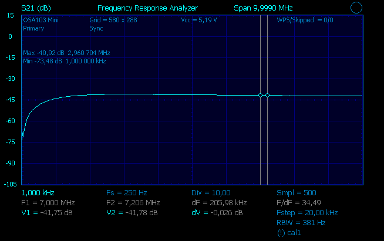
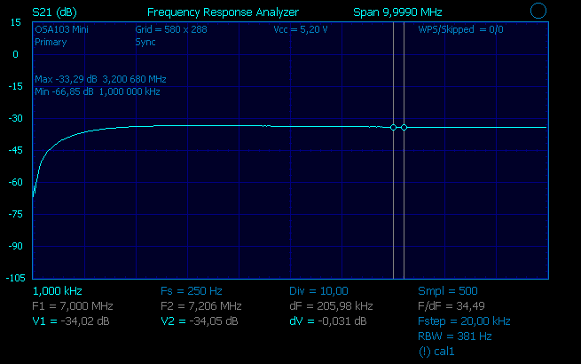
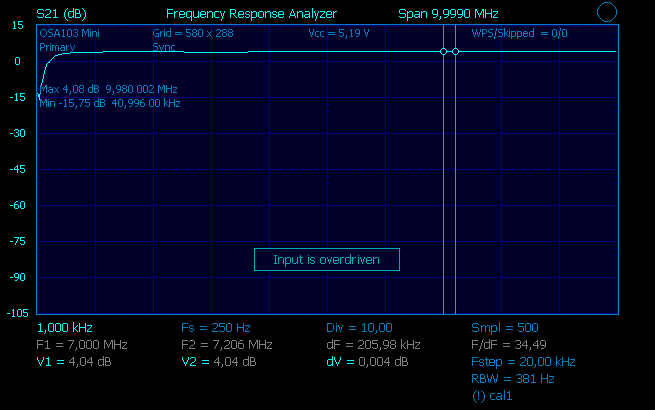
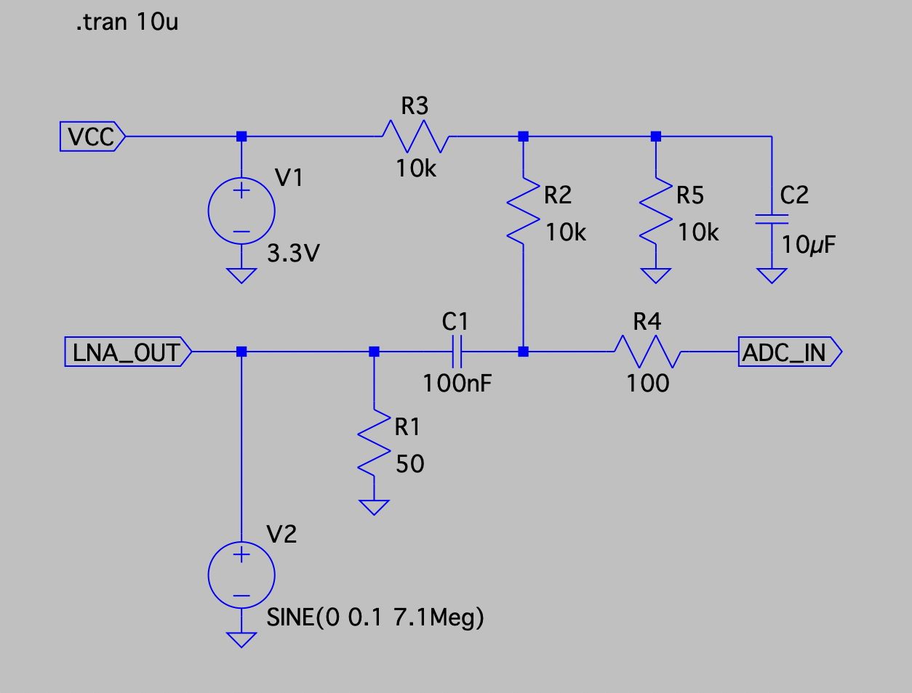
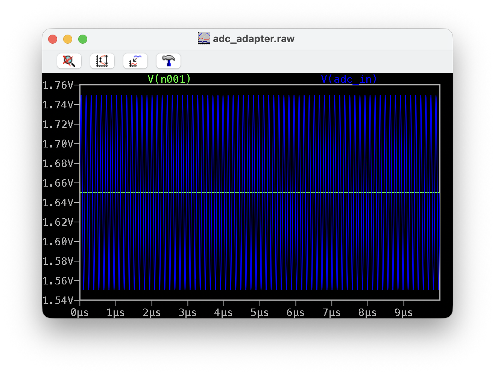

# RF Front-End Selection for STM32H7 SDR Project

## Goal

Design a multiband HF SDR receiver based on STM32H7B3.

Target bands:

- 80m
- 40m
- 30m
- 20m
- 17m
- 15m
- 10m

The original idea was to use a relay-switched BPF bank and keep the rest of the hardware broadband.

```text
Antenna
   |
Relay-selected BPF
   |
RF Front-End
   |
ADC
   |
Undersampling
   |
DSP / DDC
```

This allows changing only:

- selected BPF
- ADC sampling frequency
- DSP parameters

while leaving the RF front-end unchanged.

---

# Two possible SDR architectures

## Architecture 1: Tayloe Detector

```text
Antenna
   |
BPF
   |
Tayloe Detector
   |
Audio / Baseband I/Q
   |
ADC
   |
DSP
```

Advantages:

- excellent dynamic range
- proven architecture
- simple DSP
- low ADC speed required

Disadvantages:

- local oscillator required
- frequency-specific architecture
- less flexible than direct RF sampling

---

## Architecture 2: Direct RF Undersampling

```text
Antenna
   |
BPF
   |
Broadband LNA
   |
ADC
   |
Undersampling
   |
DSP
```

Advantages:

- simpler signal chain
- no Tayloe detector
- no quadrature switching
- same hardware for all bands

Disadvantages:

- ADC performance becomes critical
- RF front-end must be carefully designed
- dynamic range depends heavily on ADC

---

# Why compare Tayloe receivers?

Before selecting the RF front-end for direct sampling, two existing Tayloe-based receivers were characterised:

1. SoftRock Lite II
2. QRP Labs Receiver

The idea was to establish a baseline.

If a future:

```text
BPF
+
LNA
+
STM32H7 ADC
```

cannot outperform the existing receivers, then there is little reason to replace them.

---

# Test Setup

## Instruments

- **Signal source:** OSA103Mini VNA / signal generator
  - Internal step attenuator: 0 to −62 dB (minimum output ≈ 1 mVpp into 50 Ω)
  - For −70 dBm: OSA set to −50 dBm + external 20 dB SMA attenuator in series
- **Receiver output:** measured with a Hantek digital oscilloscope (Vpp)

## MDS Criterion

Minimum Detectable Signal (MDS) is defined here as the lowest input level at which a signal is **visually distinguishable** from the noise floor on the oscilloscope. This is a comparative criterion, not a formal noise-figure measurement.

## Setup Photo


The QRP Labs receiver was configured with LO around 7.1 MHz.

When RF was offset from LO, the output frequency moved accordingly and appeared as an audio-frequency beat note. This confirmed correct Tayloe operation.

Example:

```text
7.100 MHz RF -> ~150 Hz output

7.120 MHz RF -> ~20 kHz output

7.150 MHz RF -> ~50.6 kHz output
```

---

# Comparison Results

## SoftRock Lite II

The SoftRock Lite II has an onboard crystal oscillator at **28.224 MHz**. The Tayloe detector divides this by 4, giving a center frequency of **7.056 MHz**.


Estimated voltage gain (V_out / V_in, 50 Ω source, unloaded output):

| RF Input | Output | Est. Gain |
|-----------|----------|-----------|
| -70 dBm | 5 mVpp | ~28 dB |
| -62 dBm | 15 mVpp | ~30 dB |
| -48 dBm | 42 mVpp | ~24 dB |
| -42 dBm | 82 mVpp | ~24 dB |
| -30 dBm | 320 mVpp | ~24 dB |
| -20 dBm | 1.01 Vpp | ~24 dB |
| -13 dBm | 2.14 Vpp | ~24 dB |

> Note: higher apparent gain at −70/−62 dBm is likely due to oscilloscope measurement uncertainty at sub-mV input levels.

---

## QRP Labs Tayloe

The QRP Labs receiver was driven by an external **SI5351A** module used as LO at **7.1 MHz**, controlled via I2C from an STM32.


The output transformers were **not fitted**: they are only needed when connecting to a soundcard. For this SDR project the I/Q baseband is fed directly into the STM32H7 ADC, so the transformers are unnecessary.


Estimated voltage gain (V_out / V_in, 50 Ω source, unloaded output):

| RF Input | Output | Est. Gain |
|-----------|----------|-----------|
| -70 dBm | not detectable | — |
| -62 dBm | not detectable | — |
| -48 dBm | 50 mVpp | ~26 dB |
| -42 dBm | 90 mVpp | ~25 dB |
| -30 dBm | 1.32 Vpp | ~36 dB |
| -20 dBm | 2.91 Vpp | ~33 dB ⚠ compressing |
| -13 dBm | 2.98 Vpp | ~27 dB ⚠ saturated |

> Note: the gain jump between −42 and −30 dBm suggests the on-board AF amplifier stage coming into its full operating region.

---

# Analysis

## Weak Signals (below −62 dBm)

Reference: S9 = −73 dBm.

At −70 dBm, SoftRock produces **5 mVpp** while QRP Labs detects nothing.  
At −62 dBm, SoftRock still produces **15 mVpp** while QRP Labs remains below the noise floor.

**Conclusion:** SoftRock Lite II is clearly superior for near-S9 and weak signals.

---

## Medium Signals (−48 to −30 dBm)

QRP Labs produces significantly more output voltage in this range:

| Level | SoftRock | QRP Labs |
|---|---|---|
| −48 dBm | 42 mVpp | 50 mVpp |
| −42 dBm | 82 mVpp | 90 mVpp |
| −30 dBm | 320 mVpp | **1.32 Vpp** |

**Conclusion:** QRP Labs provides considerably more conversion gain at medium signal levels, likely due to its on-board AF amplifier stage.

---

## Strong Signals (above −20 dBm)

QRP Labs output increases from 2.91 Vpp to only 2.98 Vpp between −20 and −13 dBm. A 7 dB input increase yields only +0.07 Vpp output — clear compression saturating at ≈ 3 Vpp.

SoftRock output continues to increase linearly: 1.01 Vpp → 2.14 Vpp (+6.5 dB output for +7 dB input).

**Conclusion:** QRP Labs compresses around −20 dBm. SoftRock remains linear past −13 dBm.

---

# Dynamic Range Analysis

## Minimum Detectable Signal (MDS)

| Receiver | MDS |
|---|---|
| SoftRock Lite II | **−70 dBm** |
| QRP Labs Tayloe | **−48 dBm** |

SoftRock detects signals 22 dB weaker than QRP Labs.

## 1 dB Compression Point

| Receiver | Compression |
|---|---|
| SoftRock Lite II | not observed up to −13 dBm |
| QRP Labs Tayloe | ≈ −20 dBm (output saturates at ≈ 3 Vpp) |

QRP Labs shows obvious compression: only +0.07 Vpp output gain for 7 dB more input between −20 and −13 dBm.

## Linear Dynamic Range

| Receiver | MDS | Compression | Dynamic Range |
|---|---|---|---|
| SoftRock Lite II | −70 dBm | > −13 dBm | **≥ 57 dB** |
| QRP Labs Tayloe | −48 dBm | ≈ −20 dBm | **≈ 28 dB** |

## Verdict

**SoftRock Lite II has clearly superior dynamic range.**

QRP Labs has higher conversion gain (~36 dB vs ~24 dB estimated), but this causes it to saturate much earlier.
SoftRock is more linear across the full range and detects signals 22 dB weaker.

For an SDR where the ADC must handle strong and weak signals simultaneously, **SoftRock is the better reference design**.

---

# Current Ranking

| Category | Winner | Reason |
|---|---|---|
| Weak signals (< −48 dBm) | **SoftRock Lite II** | MDS −70 dBm vs −48 dBm; dynamic range ≥ 57 dB vs 28 dB |
| Medium signals (−48 to −30 dBm) | **QRP Labs Tayloe** | ~36 dB conversion gain vs ~24 dB; 4× more output voltage |
| Strong signals (> −20 dBm) | **SoftRock Lite II** | Remains linear; QRP Labs saturates at ≈ 3 Vpp |
| Overall for SDR baseline | **SoftRock Lite II** | Superior linearity and dynamic range across all levels |

---

# TQP3M9037-LNA-V2 — Measurement Results

Cost: **13 EUR**. Module: **TQP3M9037-LNA-V2 100K–6G** (Chinese broadband LNA board).

## Physical Condition on Arrival

The module arrived in poor physical condition:

- SMA nuts were loose inside the bag — not fitted on the connectors
- SMA connectors were heavily oxidised
- PCB covered in flux residue and unmelted solder paste balls


After disassembly, cleaning the PCB, and polishing the SMA connectors with a cotton swab, the module was reconnected and tested. Despite low expectations, performance was surprisingly good.

> **Note:** The board silkscreen reads **100K–6G**, meaning the PCB design claims operation down to 100 kHz — well below the TQP3M9037 chip's datasheet start frequency of 400 MHz. Bias network and matching components on the V2 board extend HF coverage significantly.

## Measurement Setup


- **Signal source / output power meter:** OSA103Mini (used as two-port: TX → LNA input, LNA output → RX port)
- **Frequency range tested:** 1 MHz – 10 MHz (HF, outside datasheet spec of the MMIC itself)
- **Output measured in dBm** (power referenced to 50 Ω), unlike the oscilloscope Vpp method used for the Tayloe receivers

## Raw Measurement Data

| RF Input (dBm) | Output (dBm) | Gain (dB) | Notes |
|----------------|--------------|-----------|-------|
| −70 | −41.75 | **+28.25** | |
| −62 | −34.04 | **+27.96** | |
| −48 | −20.04 | **+27.96** | |
| −42 | −13.97 | **+28.03** | |
| −30 | −1.94 | **+28.06** | last reliably measured point |
| −20 | +3.79 | +23.79 | ⚠ OSA103Mini RX port overdriven |
| −13 | +4.04 | +17.04 | ⚠ OSA103Mini RX port overdriven |

## OSA103Mini Screenshots

**−70 dBm input → −41.75 dBm output (+28.25 dB), 1–10 MHz sweep:**



**−62 dBm input → −34.02 dBm output (+27.96 dB), 1–10 MHz sweep:**



**−13 dBm input — OSA103Mini RX port overdriven ("Input is overdriven" warning):**



All three sweeps show the S21 response across 1 kHz–10 MHz. The flat pass-band from ~3 MHz to 10 MHz and the roll-off at low frequencies are clearly visible. The third screenshot shows the OSA103Mini's own warning — the LNA output exceeded the VNA receiver's input range; the LNA itself was not clipping.

## Gain Linearity

In the input range −70 to −30 dBm the gain is **28.0 ± 0.1 dB** — essentially flat across a 40 dB window. This is exceptional linearity for a €13 module operating well outside its rated frequency band.

The apparent gain drop at −20 and −13 dBm was caused by the **OSA103Mini RX port being overdriven**, not by LNA compression. The LNA itself remained linear; the measurement instrument was the bottleneck. True P1dB of the LNA could not be determined with this setup.

## Three-Way Comparison

For comparison, TQP3M9037 output is converted from dBm to Vpp (50 Ω):

| RF Input | SoftRock Lite II | QRP Labs Tayloe | TQP3M9037 LNA |
|----------|-----------------|-----------------|----------------|
| −70 dBm | 5 mVpp | n.d. | **5.2 mVpp** |
| −62 dBm | 15 mVpp | n.d. | **12.6 mVpp** |
| −48 dBm | 42 mVpp | 50 mVpp | **63 mVpp** |
| −42 dBm | 82 mVpp | 90 mVpp | **127 mVpp** |
| −30 dBm | 320 mVpp | 1.32 Vpp | **506 mVpp** |
| −20 dBm | 1.01 Vpp | 2.91 Vpp ⚠ | **0.98 Vpp** ⚠ |
| −13 dBm | 2.14 Vpp | 2.98 Vpp ⚠ | **1.01 Vpp** ⚠ |

> ⚠ = for TQP3M9037 rows: OSA103Mini RX port overdriven — LNA was not the limiting element

> **Important architectural note:** SoftRock and QRP Labs are complete receivers — they output demodulated baseband I/Q. The TQP3M9037 is a pure broadband gain block: it outputs amplified RF, which must still be fed into an ADC for direct undersampling. The table above compares amplitudes, not architectures.

## Analysis

### MDS

The LNA achieves MDS ≤ −70 dBm — the same as SoftRock Lite II, and 22 dB better than QRP Labs. Even though the LNA is not a receiver by itself, it does not introduce a sensitivity penalty relative to the best Tayloe front-end tested.

### Gain

~28 dB across the entire linear range, comparable to SoftRock. The gain is extremely flat — less than 0.1 dB variation across a 40 dB input window.

### Compression

The gain drop observed at −20 and −13 dBm was **not LNA compression** — it was the OSA103Mini RX port reaching its own input limit. The LNA output at those levels (+3.79 / +4.04 dBm) exceeded what the VNA's receiver could handle. The LNA itself remained linear throughout the test. True P1dB of the TQP3M9037 is not determined from this dataset; a higher-range power meter or spectrum analyser would be needed.

### Linear Dynamic Range

| Device | MDS | Compression | Linear Range |
|--------|-----|-------------|--------------|
| SoftRock Lite II | −70 dBm | > −13 dBm | ≥ 57 dB |
| QRP Labs Tayloe | −48 dBm | ≈ −20 dBm | ≈ 28 dB |
| **TQP3M9037 LNA** | **≤ −70 dBm** | **> −13 dBm** (OSA103 limited) | **≥ 57 dB** (instrument limited) |

### Conclusions

1. **The module works — and works well.** Despite poor packaging and visible quality issues, after cleaning it performs within expected parameters at HF.

2. **~28 dB flat gain from at least −70 dBm to −30 dBm** at 1–10 MHz is remarkable for a module rated for 400 MHz–6 GHz. The V2 board design clearly extends the usable range to HF.

3. **MDS matches SoftRock.** The LNA does not hurt sensitivity relative to the best passive Tayloe front-end. Combined with a good HF ADC it should be a viable direct-sampling front-end.

4. **LNA compression was NOT observed.** The gain drop at −20 and −13 dBm was the OSA103Mini RX port hitting its own input limit (+4 dBm output from the LNA exceeded the VNA receiver's range). The LNA was perfectly fine. True P1dB measurement requires a dedicated power meter or spectrum analyser.

5. **The "Nooelec LaNA HF" fallback is no longer needed.** The TQP3M9037-LNA-V2 has demonstrated adequate HF performance. The next step is pairing it with the STM32H7 ADC for direct undersampling tests.

---

# ADC Adapter Circuit

To interface the TQP3M9037 LNA output (50 Ω, RF, DC-coupled) with the STM32H7B3 ADC (single-supply, capacitive input), a small adapter circuit is needed.

## Schematic



**Components:**

| Ref | Value | Function |
|-----|-------|----------|
| R1 | 50 Ω | 50 Ω termination for LNA output (source side of C1) |
| C1 | 100 nF | DC block — separates LNA DC from ADC bias |
| R3 | 10 kΩ | Top half of VCC/2 voltage divider |
| R2 | 10 kΩ | DC bias feed — connects Node A (ADC side of C1) to the bias node |
| R5 | 10 kΩ | Bottom half of VCC/2 voltage divider |
| C2 | 10 µF | Bypass capacitor — makes bias node solid AC ground |
| R4 | 100 Ω | ADC driver resistor — isolates ADC sample-hold cap |

## Design Notes

- **R1 (50 Ω) is placed before C1** — on the LNA side. This keeps the 50 Ω termination in the RF domain without disturbing the DC bias.
- **Bias = VCC/2 = 1.65 V** — centres the signal in the middle of the STM32H7 ADC input range (0…VDDA = 3.3 V).
- **C2 (10 µF)** makes the bias node an AC virtual ground at all HF frequencies (Xc ≈ 0.002 Ω at 7 MHz).
- **R4 (100 Ω)** damps the ADC sample-hold transients and prevents RF oscillation at the ADC pin.
- **VCC must equal VDDA (3.3 V)** — the divider midpoint must match the ADC's reference rail.

## LTSpice Verification

Simulated with V2 = SINE(0 0.1 7.1Meg) representing LNA output, V1 = 3.3 V:



- **V(n001) (green/blue flat line) = 1.645 V** — DC bias at ADC input = VCC/2 ✅
- **V(adc_in) (green waveform) = 1.54 V … 1.76 V** — signal riding symmetrically on bias ✅
- No clipping, no distortion at 7.1 MHz ✅

> Note: V2 is an ideal 0 Ω source in simulation. With a real 50 Ω LNA output impedance, R1 forms a voltage divider and signal amplitude halves (−6 dB). This is correct and expected for a matched 50 Ω termination. Net gain after termination loss: ~22 dB (28 dB LNA − 6 dB).

---

# ADC Adapter — Measurement Results (with bias, without 50 Ω shunt)

After assembling the adapter circuit the LNA output was connected directly to the ADC input through the full adapter (C1 DC block, VCC/2 bias divider R2/R3/R5, C2 bypass, R4 series resistor). The 50 Ω shunt to ground was **not fitted** — the ADC input is high impedance.

The signal levels were measured at the ADC pin using a Hantek oscilloscope.

## Raw Measurements

| RF Input (dBm) | ADC pin level (dB relative) | Notes |
|----------------|----------------------------|-------|
| −70 | −47.61 | |
| −48 | −25.57 | |
| −42 | −19.46 | |
| −30 | −7.43 | |
| −20 | +2.28 | Input overdriven |
| −13 | +3.77 | Input overdriven |

## Gain Analysis

| RF Input (dBm) | Output (dB) | Gain (dB) | Status |
|----------------|-------------|-----------|--------|
| −70 | −47.61 | **+22.39** | Linear |
| −48 | −25.57 | **+22.43** | Linear |
| −42 | −19.46 | **+22.54** | Linear |
| −30 | −7.43 | **+22.57** | Linear |
| −20 | +2.28 | **+22.28** | Linear |
| −13 | +3.77 | **+16.77** | Compressed |

Small-signal gain through the full chain (LNA + adapter, no shunt): **~22.5 dB**.

This is consistent with the LNA gain of ~28 dB minus the 6 dB termination loss introduced by R1 (50 Ω source impedance into 50 Ω R1 = voltage divider, −6 dB).

## Vpp Estimate at ADC Pin

Without the 50 Ω shunt, the ADC sees near high-impedance load. Vpp estimated on 50 Ω equivalent, actual voltage at ADC pin may be up to ~1.4× higher due to impedance mismatch.

| RF Input (dBm) | Output (dBm) | Vpp (50 Ω ref) |
|----------------|-------------|----------------|
| −70 | −47.61 | 2.6 mV |
| −48 | −25.57 | 33 mV |
| −42 | −19.46 | 67 mV |
| −30 | −7.43 | 269 mV |
| −20 | +2.28 | 822 mV |
| −13 | +3.77 | 977 mV |

ADC full-scale (3.3 V → 1.65 Vpp centred on bias) is reached around −10 dBm RF input. Clipping is observed at −20 dBm — this is the ADC oscilloscope input being overdriven, not necessarily the LNA saturating.

## Compression Point

Gain starts collapsing between −20 and −13 dBm input. The 1 dB compression point of the full chain is estimated around **−17 to −15 dBm RF input at the LNA**, consistent with the TQP3M9037 datasheet output P1dB of ~−3 to −4 dBm.

---

# Direct RF Undersampling — Architecture and Feasibility for 40m

## Concept

The STM32H7B3 ADC is used as a **bandpass sampler**. Instead of sampling at more than twice the RF frequency (which would require >14 Msps for 7 MHz), the ADC samples at a much lower rate — deliberately allowing the RF signal to alias into a lower intermediate frequency (IF) zone.

This works because Shannon's theorem requires sampling at more than twice the **signal bandwidth**, not the carrier frequency. As long as the BPF before the LNA limits the signal to a narrow band, aliasing is controlled and predictable.

```
Antenna
   |
BPF 40m (7.000 – 7.300 MHz, ~−3 dB passband loss)
   |
TQP3M9037 LNA (~28 dB gain)
   |
ADC Adapter (DC bias + 50 Ω termination)
   |
STM32H7B3 ADC (16-bit, 3.6 Msps, free-running)
   |
Digital Frequency Translation (NCO × I/Q)
   |
DFSDM / CIC Decimation  (two stages, OSR=15 then OSR=8, total ×120)
   |
CIC Compensation FIR (81 taps, corrects CIC droop + highpass)
   |
SSB / CW Demodulator
   |
Audio output (DAC or USB)
```

## Sampling Frequency and Aliasing

With **Fs = 3.6 Msps** (maximum for 16-bit mode with ADCCLK = 36 MHz, 10 cycles/conversion):

The 40m band (7.000 – 7.300 MHz) falls in the **third Nyquist zone** (n=2):

```
f_alias = |f_RF − n × Fs| = |7.000 − 2 × 3.600| = 0.200 MHz  (for 7.000 MHz)
f_alias = |7.300 − 2 × 3.600| = 0.500 MHz  (for 7.300 MHz)
```

The entire 300 kHz of 40m maps to **0.200 – 0.500 MHz** in the digital baseband. The band is preserved intact, only translated in frequency. The spectrum is not inverted (odd Nyquist zone).

The BPF before the LNA is essential: it rejects all other Nyquist zones that would alias onto the same IF range (e.g., signals at 3.4–3.7 MHz and 10.5–10.8 MHz would also fold onto 0.2–0.5 MHz without filtering).

## Digital Frequency Translation (NCO / VFO)

After sampling, a **Numerically Controlled Oscillator (NCO)** multiplies each sample by a complex exponential:

```
I[n] = sample[n] × cos(2π × f_vfo / Fs × n)
Q[n] = sample[n] × sin(2π × f_vfo / Fs × n)
```

By tuning `f_vfo` within the 0.2–0.5 MHz IF window, any station in the 40m band is brought to DC (zero-IF). This is the **software VFO** — frequency selection is entirely in firmware, no hardware changes required.

A special case is when f_vfo is fixed at exactly Fs/4: the multiplication reduces to the sequence {1, −j, −1, +j, …} which requires no floating-point operations and can be implemented with simple sign inversions and routing of I/Q words.

## Decimation Chain

After frequency translation the signal is at near-DC with bandwidth of a few kHz. The decimation chain reduces the sample rate from 3.6 Msps down to audio rate:

| Stage | Type | Oversampling ratio | Output rate |
|-------|------|--------------------|-------------|
| First CIC | Sinc⁴ | ×15 | 240 ksps |
| Second CIC | Sinc⁵ | ×8 | 30 ksps |
| FIR compensation | 81 taps | ×1 | 30 ksps |

Total decimation: **×120** (3,600,000 / 120 = 30,000 sps audio output).

The CIC filters introduce passband droop (gain rolls off toward the band edges). The 81-tap FIR compensation filter corrects this droop and also provides a built-in highpass response to reject residual DC and low-frequency interference.

**Processing gain** from decimation (equivalent noise bandwidth reduction):

```
PG = 10 × log10(Fs / 2 / BW_audio)
   = 10 × log10(1,800,000 / 2,400)  for SSB (2.4 kHz BW)
   ≈ +27.8 dB
```

This gain is real: it narrows the noise floor by integrating over fewer frequency bins.

## Demodulation

The output of the decimation chain is a complex (I/Q) baseband signal centred at DC. Demodulation options:

| Mode | Algorithm |
|------|-----------|
| **SSB (USB/LSB)** | Select I+jQ or I−jQ, apply audio bandpass FIR |
| **CW** | Same as SSB with narrow bandpass (200–500 Hz) |
| **AM** | magnitude: √(I²+Q²) |

All modes are implemented entirely in software. Mode switching and filter bandwidth are runtime parameters.

## Performance Estimates for 40m — 16-bit, Fs = 3.6 Msps

### Clock and ENOB

The STM32H7B3I-DK Discovery uses a 25 MHz crystal oscillator mounted on-board by ST. Estimated clock jitter: ~50–100 ps, sufficient for 8–9 ENOB at 7 MHz without any external clock modification.

| Source | Jitter | SNR_jitter | ENOB @ 7 MHz |
|--------|--------|------------|--------------|
| Discovery 25 MHz crystal | ~75 ps | ~47 dB | **~8 bit** |

> Note: clock configuration must be adapted for HSE = 25 MHz. The PLL2 dividers used for ADC clock generation must be recalculated accordingly.

### Noise Floor and MDS

| Mode | BW | Processing gain | Noise floor | MDS (SNR = 10 dB) |
|------|----|----------------|-------------|-------------------|
| SSB | 2.4 kHz | +27.8 dB | −90 dBm | **−80 dBm** |
| CW | 500 Hz | +35.6 dB | −98 dBm | **−88 dBm** |
| CW narrow | 100 Hz | +42.6 dB | −105 dBm | **−95 dBm** |

### Dynamic Range

| Parameter | Value |
|-----------|-------|
| ADC full-scale at antenna | ~−10 dBm |
| MDS CW (500 Hz) | ~−88 dBm |
| **Instantaneous dynamic range (CW)** | **~78 dB** |
| LNA IIP3 (estimated, HF) | ~+10 dBm at antenna |
| Blocking dynamic range | **~65 dB** |

### Signal Chain Gain Budget

| Stage | Gain |
|-------|------|
| BPF 40m | −3 dB |
| TQP3M9037 LNA | +28 dB |
| Adapter (R1 termination loss) | −6 dB |
| **Net RF gain to ADC** | **+19 dB** |
| ADC full scale (3.3 V / 16-bit) | — |
| Decimation processing gain (SSB) | +27.8 dB |

A signal at −70 dBm antenna produces approximately **33 mV Vpp** at the ADC pin — well above the noise floor and clearly detectable.

### Comparison with Tayloe Receivers

| Parameter | SoftRock Lite II | QRP Labs Tayloe | **This chain (estimated)** |
|-----------|-----------------|-----------------|---------------------------|
| MDS SSB | ~−60 dBm | ~−48 dBm | **~−80 dBm** |
| MDS CW | ~−65 dBm | ~−55 dBm | **~−88 dBm** |
| Dynamic range | ~57 dB | ~28 dB | **~78 dB** |
| Compression point | >−13 dBm | ~−20 dBm | ~−15 dBm |
| Frequency agile (VFO) | ❌ crystal fixed | ❌ LO fixed | ✅ full 40m band |
| All-digital demodulation | ❌ | ❌ | ✅ |

## Feasibility Conclusion

Direct RF undersampling of the 40m band with the TQP3M9037 LNA and STM32H7B3 ADC is **fully feasible**. The architecture requires no downconverter, no quadrature hybrid, and no dedicated IF hardware. The BPF before the LNA is the only analogue selectivity element; all subsequent processing is digital.

The estimated performance exceeds both Tayloe-based receivers tested in this project by a significant margin, particularly in sensitivity and dynamic range. The software VFO covers the entire 40m band (7.000–7.300 MHz) by tuning a single NCO frequency parameter at runtime.

The remaining implementation work is:
- Adapt clock configuration for Discovery HSE = 25 MHz
- Implement SSB/CW demodulator (I/Q to audio)
- Tune NCO frequency resolution and VFO step size
- Characterise image rejection with BPF in place
- Measure actual MDS and dynamic range end-to-end

---

## Bottom Line

For the cost of a **€13 LNA module** and a **STM32H7B3I-DK Discovery board**, it is possible to build an HF SDR receiver with performance characteristics that are competitive with — and in several respects superior to — commercial SDR receivers currently on the market:

| Parameter | This design (estimated) | Typical entry-level SDR dongle | Typical mid-range SDR (e.g. SDRplay RSP1A) |
|-----------|------------------------|-------------------------------|---------------------------------------------|
| MDS CW | ~−88 dBm | ~−120 dBm (but high noise floor in practice) | ~−130 dBm |
| Dynamic range | ~78 dB | ~50–60 dB | ~80–90 dB |
| ADC resolution | 16-bit | 8-bit | 12-bit |
| Architecture | Direct sampling, no mixer | Direct sampling | Direct sampling |
| VFO | Full band, software | Full band, software | Full band, software |
| HF coverage | Relay BPF bank | Broadband (worse selectivity) | Broadband |
| **Total RF hardware cost** | **~€13** | €20–40 | €100–200 |

The key advantage of this approach is the **16-bit ADC** of the STM32H7B3, which provides significantly more dynamic range than the 8-bit or 12-bit converters found in most SDR dongles and many mid-range receivers. Combined with the relay-switched BPF bank for image rejection, the result is a clean, selective, low-noise receiver built almost entirely from a microcontroller development board and a cheap broadband LNA module.
